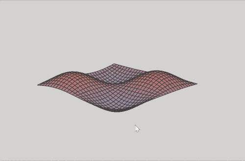
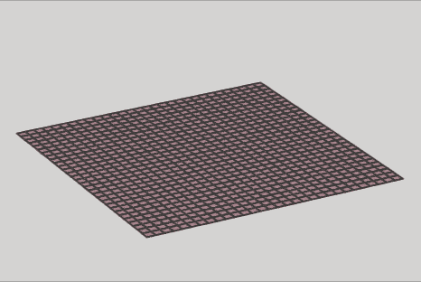

# scalar-field-renderer  

a humble little library meant for rendering 3D scalar fields using [Canvas2D](https://developer.mozilla.org/de/docs/Web/API/CanvasRenderingContext2D) only.  

in a previous project, i wrote a simple [voxel renderer](https://github.com/flurrux/canvas-voxel-game) and noticed the same principles could be used to render heightmaps as well.  

unfortunately, it has the same downsides, namely poor performance for a large number of rendered cells.  
why do this then?  
well i simply love the quick setup and debug capabilities of Canvas2D, plus drawing thick lines is [that much simpler](https://mattdesl.svbtle.com/drawing-lines-is-hard).  




```
import { setupHeightMapScene, centerGridField } from "@flurrux/simple-scalar-field-renderer";

const sceneController = setupHeightMapScene({
  gridField: center({ 
    position: [0, 0], 
    cellSize: 0.1, 
    size: [30, 30]
  }), 
  heightMap: ([x, y]) => {
    const f = 2;
    return Math.sin(p[0] * f) * Math.sin(p[1] * f) * 0.35;
  },
  shape: "triangle"
});
```

```sceneController``` has the following type:  

```
type HeightMapScene = {
  updateHeightMap: (newHeightMap: ScalarField) => void,
  updateColorField: (newColorField: ColorField) => void,
  requestRender: Morphism<void, void>,
  transformCamera: Morphism<Transformation<OrbitCamera>, void>
}
```

```updateHeightMap``` can be used to animate the field:  




```

import { startLoop } from "@flurrux/simple-scalar-field-renderer";

startLoop(
  (args) => {
    const f = 2;
    sceneController.updateHeightMap(
      ([x, y]) => Math.sin(x * f) * Math.sin(y * f) * 0.35 * Math.sin(args.t)
    );
  }
);

```